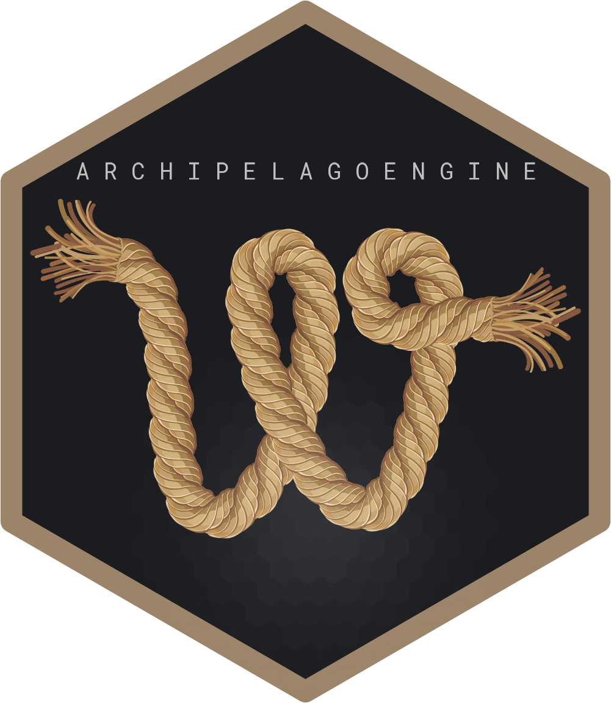
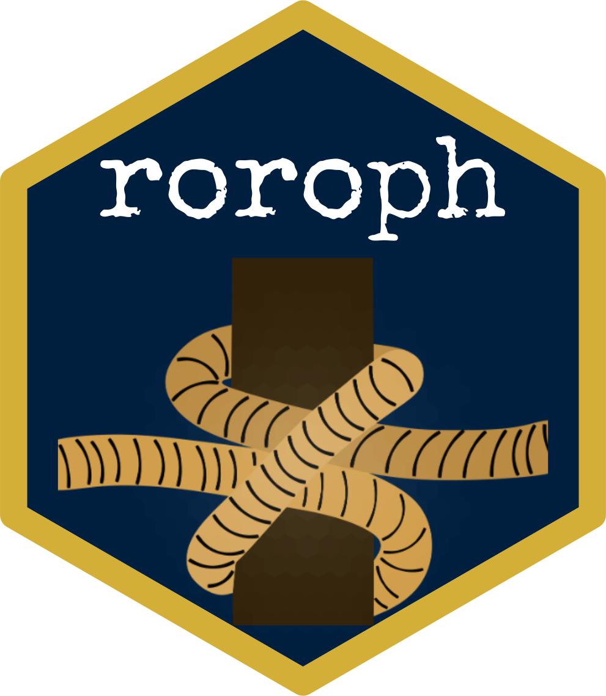
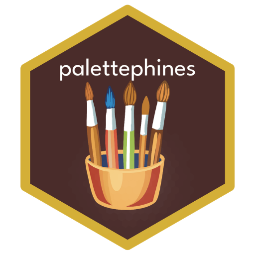

::: {.software-grid}

::: {.software-card}
::: {.software-logo-box}
{alt="ArchipelagoEngine Hex Logo" class="software-logo"}
:::

::: {.software-info}
### ArchipelagoEngine
Implements specialized spatial weights matrices tailored to prevent geographic data isolation among fragmented islands.

[View on GitHub](https://github.com/pinasr/ArchipelagoEngine){.btn .software-btn target="_blank"}
[View on CRAN](https://cran.r-project.org/web/packages/ArchipelagoEngine/index.html){.btn .software-btn target="_blank"}

:::
:::

::: {.software-card}
::: {.software-logo-box}
{alt="roroph Hex Logo" class="software-logo"}
:::

::: {.software-info}
### roroph
A machine-readable spatial data network capturing provincial links, shipping coordinates, and transit timelines across the Philippine Nautical Highway.

[View on GitHub](https://github.com/pinasr/roroph){.btn .software-btn target="_blank"}
[View on CRAN](https://cran.r-project.org/web/packages/roroph/index.html){.btn .software-btn target="_blank"}

:::
:::

::: {.software-card}
::: {.software-logo-box}
{alt="palettephines Hex Logo" class="software-logo"}
:::

::: {.software-info}
### palettephines
Biologically grounded color maps reflecting distinct Philippine ecological landscape phenology patterns for data visualization pipelines.

[View on GitHub](https://github.com){.btn .software-btn target="_blank"}
[View on CRAN](https://cran.r-project.org/web/packages/palettephines/index.html){.btn .software-btn target="_blank"}

:::
:::

:::

